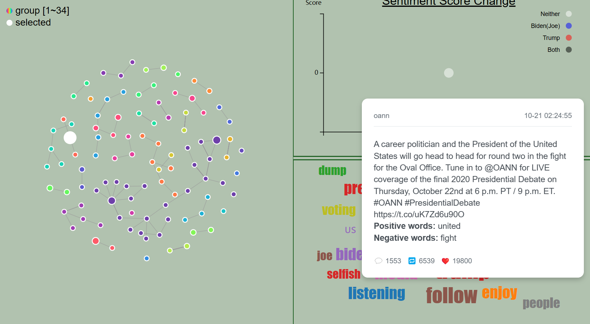
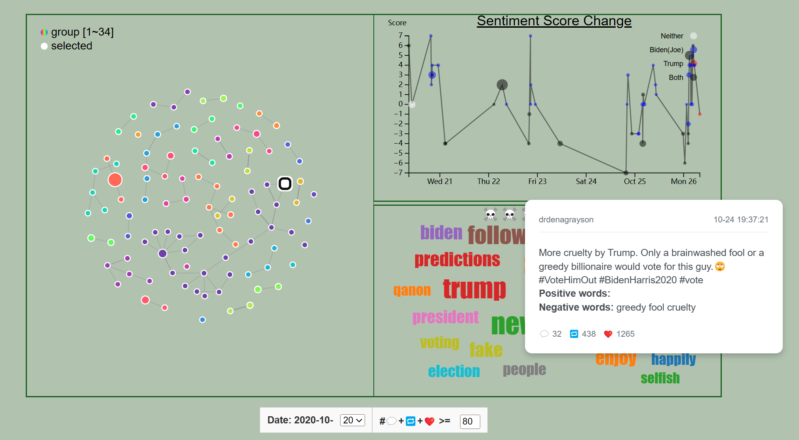
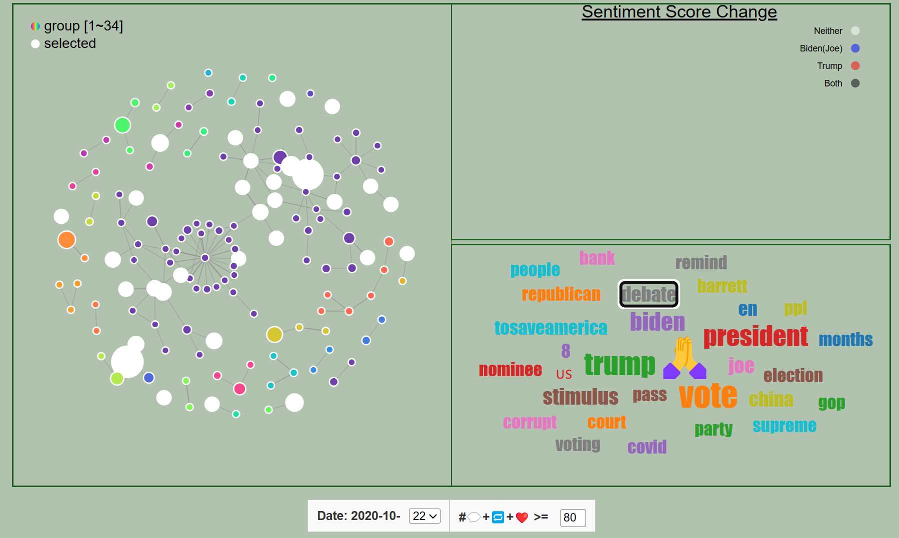

# 分析报告

## 1. 数据处理

选用数据为推特数据，数据处理步骤

- 去重，去掉 tweet 项为空的 obj
- 对推特文本进行清洗，去除无意义的字符
- 根据推特文本中是否含有 Biden/Joe 或 Trump 给推特加上 tag
- 情感分析：调用 sentiment 库对文本进行情感分析
- 对所有推特按用户进行聚合

## 2. 探索问题

社交媒体舆情演变、关键词变化，关键人物行为

### 功能一 ：分析用户关系网，识别关键人物

以用户为节点，按推特间 mention, reply_to, quote 的关系建立了用户关系网，图中同一颜色的节点处在同一连通子图中，节点的大小表示用户当天所发所有推特得到的回复+转发+like数，从中可以发现关键用户。如图中，用户名为 oann 的用户仅在这期间发了一条推特，就得到多达2w的like，经搜索发现它是新闻媒体 One America News 的账号。

### 功能二：分析推特情感得分变化，推断用户立场，分析推文影响力变化

在右上角绘制了选中用户所发的所有推特的情感得分变化，可以看到该用户只包含Biden(Joe)的推特的得分多数具有较高的情感得分，从中可以得知该用户的立场，检查其推特内容可以验证其支持拜登，反对特朗普的立场。且数据点圆圈的大小与该推文得到的回复+转发+like数成正相关，从中可以看到该用户的推特随时间的影响力变化。

### 功能三：分析关键词，联系关键人物

在右下角绘制了左图中所有结点对应用户所发的所有推特的词云，点击词云可以查看哪些用户的推特中包含了该关键词。如观察22日这天的数据发现，提到 debate 的用户非常多，结合实际我们知道22日举行了最后一次辩论。

### 更多说明

- 提供了日期选择栏，可以切换日期，查看每一天活跃的用户及其推特关系网，右下角的词云图随之更新
- 可以设置阈值，只保留比较重要的用户，按需求简化或细化力导引图